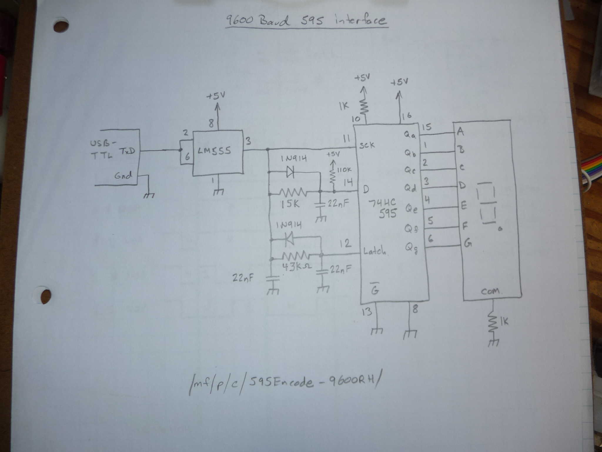

This is a synchronous-over-asynchronous demo.

The 595 chips can be chained for more outputs.
The serial source needs to be pause-free, thats why the low baud rate was chosen. It also helps get around value tolerances and noise.

Its quite a simple ciruit, the incomming waveform is broken down into high and low times. The timing is designed such that it can be fit within the start and end bits of a transmisison. 
These notes should be enough to help re-engineer the protocol if you want (faster/slower/inverted/non-inverted)

Here a 555 is used for a schmitt-trigger, the system has been adapted to deal with the inversion (engineering option)

 

